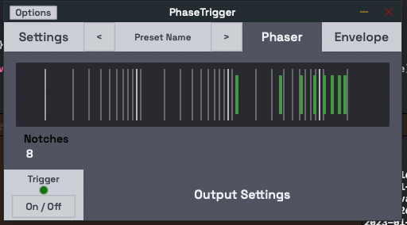

<h1> PhaseTrigger </h1>

PhaseTrigger is (eventually) going to be a simple audio plugin designed to give sound designers full control over phasing effects.
This will be achieved via 
- Midi Triggered Envelopes
- Customisable envelopes for individual phaser notches, or linked
- Multiple notches

Created using JUCE Framework, this is currently a non-profit educational project for my own learning and enjoyment.

<h3> Progress </h3>
<h4> 4 Jan - 5 Jan </h4>

Thanks to some help from [Matthjis Hollemans](https://leanpub.com/u/machinethink) I was able to get the visualisation for the logspaced frequency spectrum onto the plugin.
I also made some custom components, and connected them to the AudioProcessorValueTreeState so that they could interact, and they do.
Next step is making a control using the component type that I created for notch, this time called "center". I will substitute the value of center for the 10khz magic number present in the phaser visualisation so that adjusting that also reflects visually.

<h4> 30 Dec - 4 Jan </h4>
So far I have focused mainly on the GUI, and established a solid base to continue building the project upon. Components are generally quite independent allowing me to intuitively navigate to parts of my application.

After a bit of cowboy coding, I decided it would be helpful to mock-up a rough idea for the application layout. This included breaking the editor into main areas and dedicating components to handle multiple children in that area. Further down the line, this allowed me to keep my editor class nice and simple, only handling application level state changes and layout.

By referencing the design (which I was not too emotionally attached to, but I needed a guide) I was able to develop a scaffold in which I am confident I can easily deliver the bulk of the application functionality from.

Next steps are to put together the phaser view and the envelope view. I haven't touched the processor side of the application yet, but ultimately these views will be filled with sliders & attachments that interact with the audioprocessorvaluetree.

Milestones achieved
- Views can be switched by clicking the envelope or phaser menuButtons
- Settings has a popup menu attached to it with a working callback for future extensions (new, load, save etc)
- Custom look and feel is doing something

